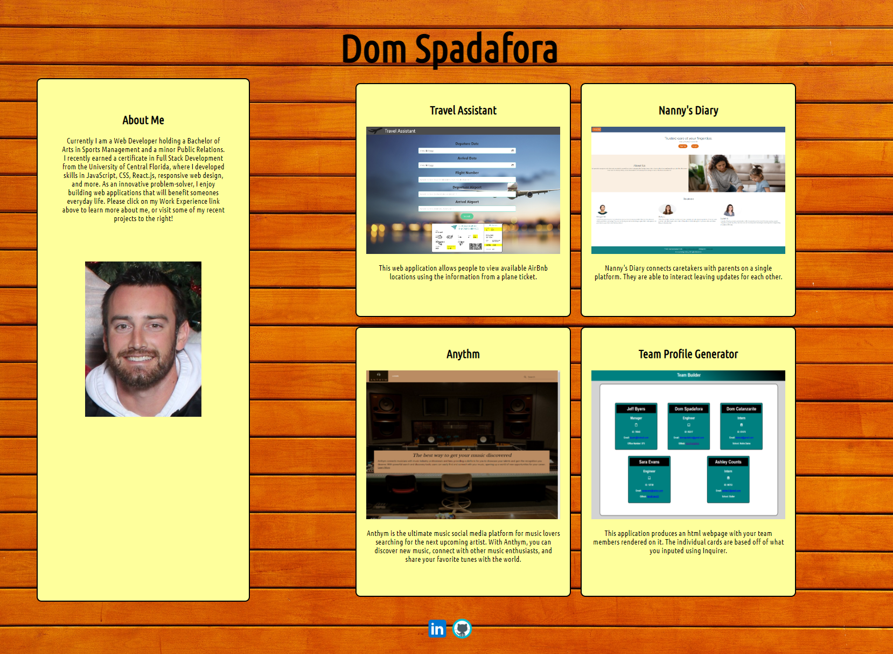

# Portfolio Creator

  

  

  ## Description
  If you need to create a quick and simple personal portfolio, this applicatino is for you. Using Node.js and Inquirer, you can create a portofolio by answering the questions through the terminal.

  ## Table of Contents
  1. [Installation](#installation)
  2. [Usage](#usage)
  3. [License](#license)
  4. [Tests](#tests)
  5. [Questions](#questions)

  ## Installation
  To install the necessary dependencies, run the following command:
  Need to clone this repo and `npm install`

  ## Usage
  Once the repo has been cloned to your local repository and the dependancies have been installed: 
  
  First, you will need to add your images to the asset folder that you want to used in your portfolio. This would typically be snapshots of your working applications. You will be asked to source these when prompted in the terminal.

  Second, open up an integrated terminal and enter `node index.js` in the terminal. Answer the questions when prompted. 

  Last, a new index.html file will be created. Basic css has been created already but you can modify as you wish. 

  ## License 
  This project is licensed under the MIT license.
  

  ## Questions
  If you have any questions about this repo, open an issue or contact me directly at [domspadafora@gmail.com](mailto:domspadafora@gmail.com).
  You can find more of my work at [DomSpadafora](https://www.github.com/DomSpadafora).
